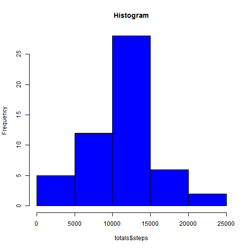
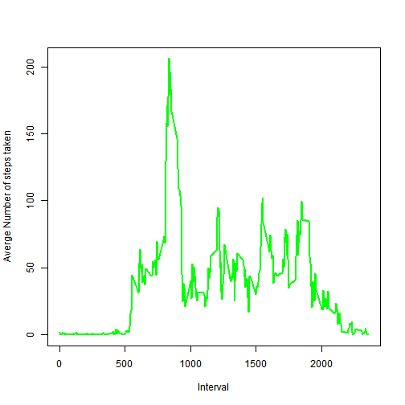
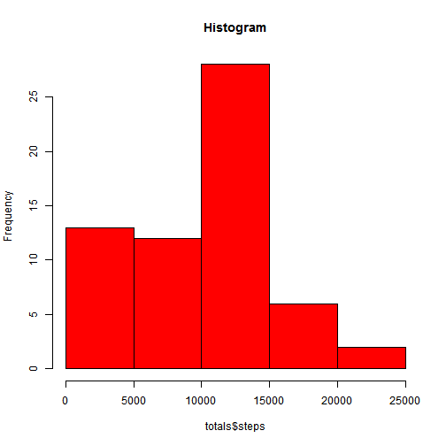
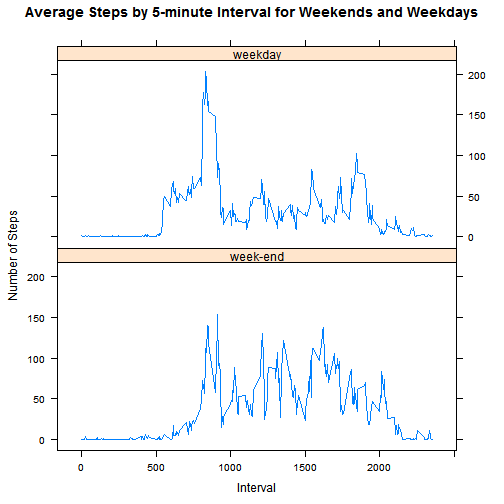

Loading and preprocessing the data

First we must set the working directory where the information was stored. Namely the csv file with the data


```r
setwd("C:/Users/Pablo/Desktop/Repreducible-Research/repdata_data_activity")
```

Then we will load the data in CSV and we store it in a variable called MyData

```r
MyData <- read.csv(file="activity.csv", header=TRUE, sep=",")
```


Then we aggregate the information in the way of steps taken per date and we store it in  variable called totals 

```r
totals<-aggregate( steps ~ date , data = MyData , FUN = sum)
```
And we produce the histogram of number of steps taken by day


```r
hist(totals$steps, main="Histogram", col="blue")
```

 


What is mean total number of steps taken per day?

We calculate the mean and median of the number of steps taken per day.


```r
mean(totals$steps)
```

```
## [1] 10766.19
```

```r
median(totals$steps)
```

```
## [1] 10765
```
Conclusion the mean is 10766.19 and the median 10765


What is the average daily activity pattern?

I will make now a time series plot of the 5-minute interval (x-axis) and the average number of steps taken, averged across all days (y-axis)

```r
totals<-aggregate( steps ~ interval , data = MyData , FUN = mean)
 plot(totals$interval, totals$steps, type="l", xlab= "Interval", ylab= "Averge Number of steps taken", col="green" , lwd=2)
```

 
From the graphic we can clearly see that the 5-minute interval, on average across all the days in the dataset, with the maximum number of steps is between the intervals 0500 and 1000.

Now we will calculate it in exact manner:

```r
interval <- which.max(totals$steps)
print(totals[interval,])
```

```
##     interval    steps
## 104      835 206.1698
```
The 5 minute interval with the maximum number of steps is 835 with 206.17 steps.


Imputing missing values

Calculate the number of missing values


```r
 sum(is.na(MyData$steps))
```

```
## [1] 2304
```

The strategy I follwed to replace missing values is very simple. I replaced the missing values by 0 and I agregate again the values

```r
MyData$steps[is.na(MyData$steps)]<-0
totals<-aggregate( steps ~ date , data = MyData , FUN = sum)
```

And we produce the histogram of number of steps taken by day


```r
hist(totals$steps, main="Histogram", col="red")
```

 
We calculate the mean and median of the number of steps taken per day.


```r
mean(totals$steps)
```

```
## [1] 9354.23
```

```r
median(totals$steps)
```

```
## [1] 10395
```
Conclusion the mean is 9354 and the median 10395
This means that the data original data set and the one we filled have different means and medians. In both cases smaller when I fill the NA values 


Are there differences in activity patterns between weekdays and weekends?

I will create a new factor variable that I will call column2 that will  tell me whether a messure was taken on weekdays or weekends


```r
MyData$day <- weekdays(as.Date(MyData$date))

values <- c("weekday", "weekday", "weekday", "weekday", "weekday","week-end", "week-end")
index <- c("Monday", "Tuesday", "Wednesday", "Thursday", "Friday", "Saturday", "Sunday")
MyData$col2 <- values[match(MyData$day, index)]
totals<-aggregate( steps ~ interval+col2, data = MyData , FUN = mean)
```

We will produce now the 2 graphics (panel plot containing a time series plot) of average number of steps taken by interval. One of the panels will be for week days and one for weekend. We will put one below the other to be able to see differences in the intervals.


```r
require("lattice")
```

```
## Loading required package: lattice
```

```r
xyplot(steps ~ interval | col2, data = totals, type = "l", layout = c(1,2), xlab = "Interval", ylab = "Number of Steps", main = "Average Steps by 5-minute Interval for Weekends and Weekdays")
```

 

Conclusion
During week days there is a peak of activity at the time most people get up early in the morning. During week ends the steps are more evenly spread.
